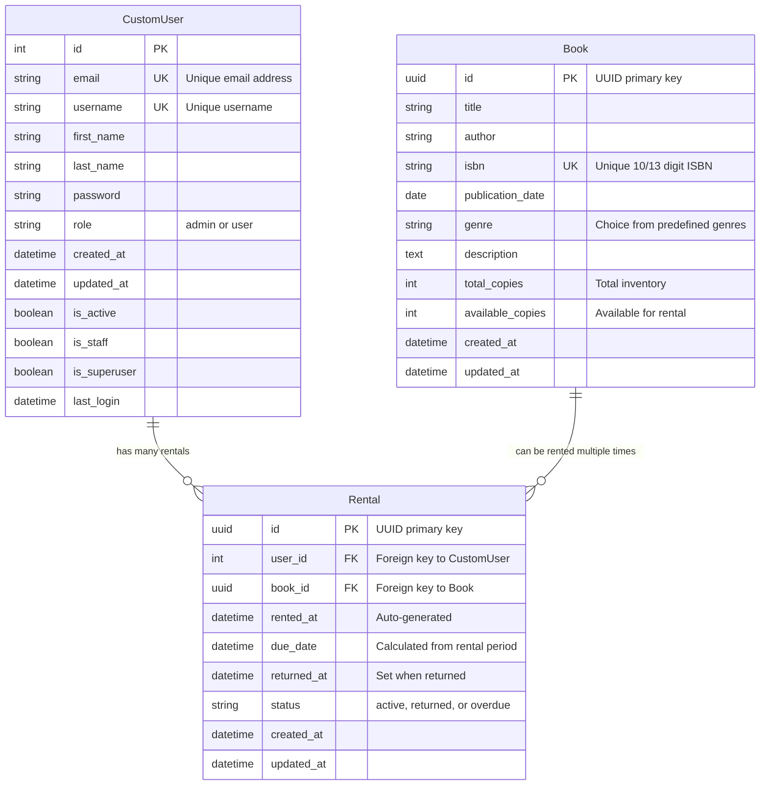

# Book Rental System - Entity Relationship Diagram

## Key Relationships

### **One-to-Many Relationships:**

1. **CustomUser → Rental** (1:N)
   - One user can have multiple rentals
   - Each rental belongs to exactly one user
   - Implemented as `user = ForeignKey(CustomUser, related_name='rentals')`

2. **Book → Rental** (1:N)
   - One book can be rented multiple times (different periods)
   - Each rental is for exactly one book
   - Implemented as `book = ForeignKey(Book, related_name='rentals')`

### **Database Constraints:**

- **Unique Together**: `(user, book, status)` prevents duplicate active rentals
- **Indexes**: Optimized queries on user+status, book+status, due_date+status
- **Validation**: Available copies cannot exceed total copies
- **UUID Primary Keys**: For books and rentals (better for distributed systems)

### **Business Logic:**

- When rental created → `book.available_copies -= 1`
- When book returned → `book.available_copies += 1`
- Auto-overdue detection when `timezone.now() > due_date`